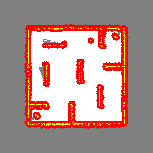

# Mapping
General instructions for project:
1. Clear free space between the scan endpoints and the robot's position, using raytrace(self, start, end) function and self.free_space variable.
2. Fill in occupied space.
3. Fill in update = OccupancyGridUpdate() to only return the updated part of the map.
4. Expand occupied space to create C-space in the inflate_map(self, grid_map) function, using self.c_space variable.

The python file mapping_assignment_metapackage/mapping_assignment/scripts/mapping.py contains the solutions for the task defined previuosly.

Mapped environment from one of the rosbag files:


### Launching
 - ``` roscore ```
 - ``` roslaunch mapping_assignment play.launch ```
 - ``` rosbag play --clock BAGFILE ```

All bag files are in /mapping_assignment/bags/ folder.